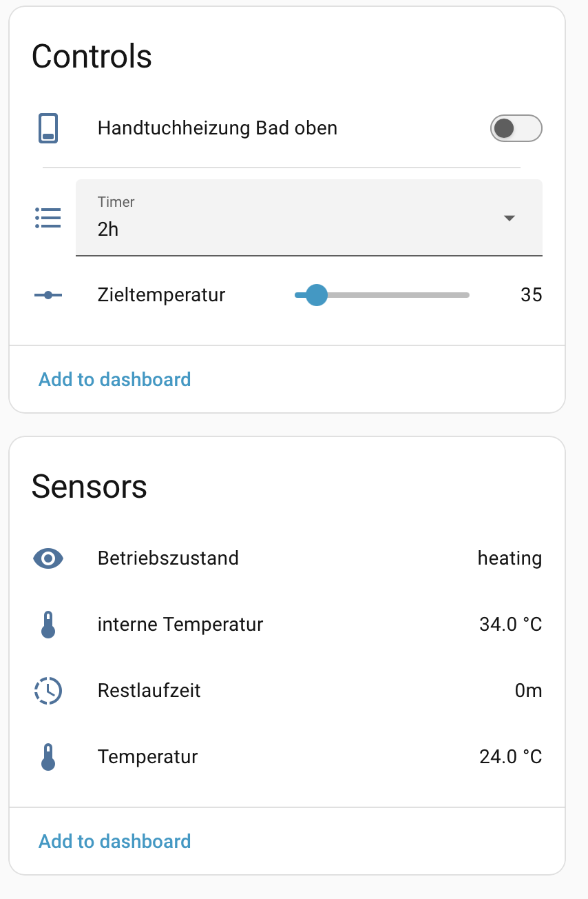

# EMKE Heated Towel Rack in Home Assistant with LocalTuya

This guide explains how to integrate an EMKE Wi-Fi heated towel rack with Home Assistant using LocalTuya. The configuration is fully local: Home Assistant communicates directly with the towel rack in your home network instead of relying on the Tuya cloud for day-to-day control.

The result is a practical bathroom-heating device with separate controls for power, target temperature, and an auto-off timer. It also exposes the current and internal temperatures, remaining timer duration, and the operating state. This makes it suitable for dashboards and automations, for example to switch it on before showering and turn it off automatically afterwards.

The tested EMKE device is shown by Tuya as `Smart Towel Rack` or `Heated Towel Rack`, model `119`, product ID `yghsoyzoicezv8sy`, and category `mjj`. Other EMKE towel racks may use different DPs, so always verify the values for your own device.

## What Home Assistant provides

- A power switch for the towel rack.
- A target-temperature control from 30 to 70 °C in 5 °C steps.
- A timer from one to 24 hours that switches the device off automatically.
- Sensors for current temperature, internal temperature, remaining timer duration, and operating state.

## What you need

| Requirement | Tested value |
|---|---|
| Tuya LAN protocol | `3.5` |
| Home Assistant integration | [Local Tuya AB](../custom-integrations/local-tuya-ab.md) |
| Integration release | `v5.2.3-ab.2` |
| DP detection | Enter the DPs manually |

The tested official LocalTuya version does not support this protocol 3.5 device. Local Tuya AB adds protocol 3.5 support and the integer option needed to set the target temperature correctly.

Before you begin:

- Pair the towel rack with Smart Life and check that it is online.
- Reserve a stable local IP address in your router.
- Get its Device ID and Local Key. Follow the [Tuya Device ID and Local Key guide](../guides/tuya-device-id-local-key.md).
- Close Smart Life completely before Home Assistant connects.
- Make sure no second Home Assistant or test tool is connected to the device.

## Add the device

In Home Assistant, open **Settings → Devices & services → LocalTuya → Configure → Add a new device**.

| Setting | Value |
|---|---|
| Name | For example `Bathroom heated towel rack` |
| Host | Current local IP address |
| Device ID | Current Device ID |
| Local Key | Current Local Key |
| Protocol Version | `3.5` |
| Enable debugging | Off |
| Scan interval | Empty |
| Manual DPS | `1,2,3,9,10,11,12,13,14,101` |
| DPIDs for RESET command | Empty |

Automatic DP detection was not reliable with this device. Entering the manual list above worked reliably.

Do not create one Climate entity. Add the following entities one after another.

## Power switch

Entity type: `switch`

| Setting | Value |
|---|---|
| ID | DP `1` |
| Friendly name | For example `Bathroom heated towel rack` |
| Current / Current Consumption / Voltage | Empty |
| Restore the last value after a lost connection | Off |
| Passive entity | Off |
| Default value | Empty |

## Target temperature

Entity type: `number`

| Setting | Value |
|---|---|
| ID | DP `2` |
| Friendly name | `Target temperature` |
| Minimum | `30` |
| Maximum | `70` |
| Minimum increment | `5` |
| Send values as integers | **On** |
| Restore the last value after a lost connection | Off |
| Passive entity | Off |
| Default value | Empty |

The **Send values as integers** option is essential. Without it, the towel rack can ignore an updated target temperature even though Home Assistant appears to accept it.

## Timer

Entity type: `select`

| Setting | Value |
|---|---|
| ID | DP `12` |
| Friendly name | `Timer` |
| Valid entries | `cancel;1h;2h;3h;4h;5h;6h;7h;8h;9h;10h;11h;12h;13h;14h;15h;16h;17h;18h;19h;20h;21h;22h;23h;24h` |
| Friendly entries | `Off;1h;2h;3h;4h;5h;6h;7h;8h;9h;10h;11h;12h;13h;14h;15h;16h;17h;18h;19h;20h;21h;22h;23h;24h` |
| Restore the last value after a lost connection | Off |
| Passive entity | Off |
| Default value | Empty |

Home Assistant displays `Off`, but sends the value `cancel` to the device. DP `13` shows the remaining time in minutes.

## Sensors

Add these Sensor entities:

| DP | Suggested name | Unit | Device class | Scaling factor |
|---:|---|---|---|---:|
| `3` | `Temperature` | `°C` | Temperature | `1` |
| `101` | `Internal temperature` | `°C` | Temperature | `1` |
| `13` | `Remaining time` | `min` | Duration | `1` |
| `14` | `Operating state` | Empty | None | `1` |

DP `14` reports values such as `heating` and `standby`. It is useful for confirming that the towel rack has actually started heating after it was switched on.

After the final Sensor entity, enable **Do not add any more entities** and finish the setup.

## DP overview

A DP, or data point, is one value or function of a Tuya device.

| DP | Tuya code | Function |
|---:|---|---|
| `1` | `switch` | Power |
| `2` | `temp_set` | Target temperature, 30–70 °C in 5 °C steps |
| `3` | `temp_current` | Current temperature |
| `9` | `temp_unit_convert` | Temperature unit; no entity needed |
| `10` | `temp_set_f` | Fahrenheit target temperature; not used |
| `11` | `temp_current_f` | Fahrenheit current temperature; not used |
| `12` | `countdown_set` | Timer from `1h` to `24h`, or `cancel` |
| `13` | `countdown_left` | Remaining time in minutes |
| `14` | `work_state` | Operating state such as `heating` or `standby` |
| `101` | `inside_temp` | Internal temperature |

## If the device is unavailable

1. Close Smart Life completely.
2. Stop other Home Assistant test systems or Tuya tools using this device.
3. Check the local IP address.
4. Check the Local Key, especially after pairing again.
5. Reload LocalTuya or restart Home Assistant.
6. Turn the towel rack off at the power supply for a short time if needed.

The Local Key can change when the device is paired again.
